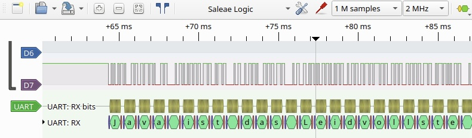
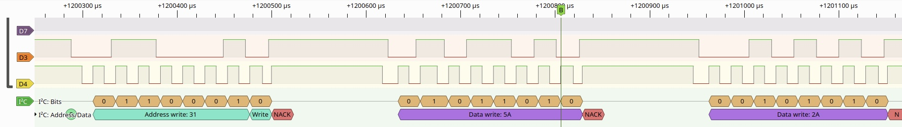

# Hardwarepraktikum Versuch 8 Protokoll

## Aufgabe 1

Um das Signal am TXD-Ausgang des Arduinos zu lesen, verbinden wir das Oszi damit und übertragen da
Wir lesen den TXD Ausgang des Arduinos mit dem Oszi aus und Speichern dies als csv Datei ab.
Diese werten wir mit einem [Python Skript](https://github.com/99cardz/HWPV8/blob/main/rs232.ipynb) aus, wobei wir die Länge eines Packets durch systematisches Ausprobieren herausgefunden haben.
Ebenfalls wurden die Daten eines Packets mit der gleichen Methode Analysiert.

Es handelt sich um das RS-232 Protokoll, in der folgenden Konfiguration:
-   Baudrate 12 kBd/s
-   Gesamtlänge 11
-   Datenlänge 8
-   2 Stopp-Bits
-   Kein Paritätsbit

Der Übertragene Satz lautete:
"Java ist das Leidvollste was der Informatik seit MS-DOS wiederfahren ist. Alan Kay"

## Aufgabe 2

Jetzt Verbinden wir den Logic Analyzer mit den Pins D2 und D3 des Arduinos und lassen uns das gesendete Signal in Pulse View anzeigen.
Diesmal handelt es sich um das I2C Protokoll. Auf D3 werden die Daten übertragen, während auf D2 das Taktsignal überträgt. Gemessen wurde eine 

